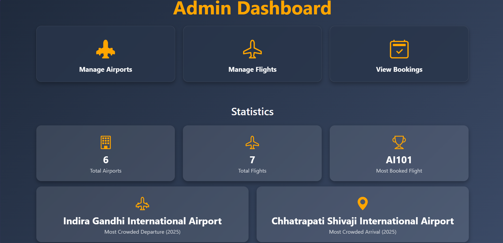
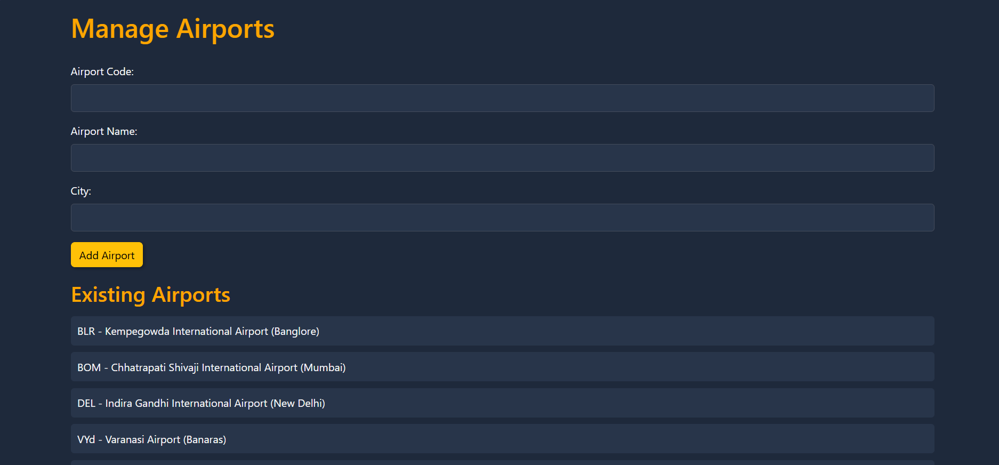

# Airline Booking System

## Project Description

The Airline Booking System is a web application that allows users to book flights, manage airports, and view bookings. The system includes functionalities for user registration, login, flight management, seat booking, and email notifications for booking confirmations.

## Link to User Side Code and Booking Interface https://github.com/VINAYAK-N-MAGAJIKONDI/flight-booking-frontend

## Table of Contents

- [Project Description](#project-description)
- [Screenshots](#screenshots)
- [Setup Instructions](#setup-instructions)
- [API Documentation](#api-documentation)
  - [User APIs](#user-apis)
  - [Airport APIs](#airport-apis)
  - [Flight APIs](#flight-apis)
  - [Booking APIs](#booking-apis)
  - [Seat APIs](#seat-apis)
- [Data Models](#data-models)
- [SQL Schema](#sql-schema)

- [License](#license)
- 
## Screenshots







## Setup Instructions

1. **Clone the repository**:
   ```sh
   git clone https://github.com/your-repo/airline-booking-system.git
   cd airline-booking-system 
   ```
2. **Install dependencies** :
   ```sh
    npm install 
   ```

3 **Set up the database** :

- Create a MySQL database and import the SQL schema provided in the ALL SQL/mysql.sql file.
- Update the .env file with your database credentials and other environment variables.
4 **Run the server**:
```sh 
npm start
```
5 **Access the application**:
 Open your browser and navigate to http://localhost:5000. 

## API Documentation

### User APIs

#### Register User

Endpoint: POST /api/users/register
Description: Registers a new user.
Request Body:
```json
{
  "fullName": "John Doe",
  "email": "john.doe@example.com",
  "password": "password123"
}
```
Response:
```json
{
  "message": "User registered successfully"
}
```
Login User

Endpoint: POST /api/users/login
Description: Logs in a user and returns a JWT token.
Request Body:
```json
{
  "email": "john.doe@example.com",
  "password": "password123"
}
```
Response:
```json
{
  "token": "jwt-token"
}
```
Get User Details

Endpoint: GET /api/users/me
Description: Retrieves the details of the logged-in user.
Headers:
```json
{
  "Authorization": "Bearer jwt-token"
}
```
Response:
```json
{
  "name": "John Doe",
  "email": "john.doe@example.com"
}
```
Airport APIs
Add Airport

Endpoint: POST /api/airports
Description: Adds a new airport.
Request Body:
```json
{
  "airportCode": "JFK",
  "airportName": "John F. Kennedy International Airport",
  "city": "New York"
}
```
Response:
```json
{
  "message": "Airport added successfully"
}
```
Get All Airports

Endpoint: GET /api/airports
Description: Retrieves a list of all airports.
Response:
```json
[
  {
    "airportCode": "JFK",
    "airportName": "John F. Kennedy International Airport",
    "city": "New York"
  },
  ...
]
```
Flight APIs
Add Flight

Endpoint: POST /api/flights
Description: Adds a new flight.
Request Body:
```json
{
  "flightNumber": "AA123",
  "departureTime": "2023-12-01T10:00:00",
  "arrivalTime": "2023-12-01T14:00:00",
  "price": 300.00,
  "departureAirport": "JFK",
  "arrivalAirport": "LAX"
}
```
Response:
```json
{
  "message": "Flight added successfully"
}
```
Get All Flights

Endpoint: GET /api/flights
Description: Retrieves a list of all flights.
Response:
```json
[
  {
    "flightId": 1,
    "flightNumber": "AA123",
    "departureTime": "2023-12-01T10:00:00",
    "arrivalTime": "2023-12-01T14:00:00",
    "price": 300.00,
    "departureAirport": "JFK",
    "arrivalAirport": "LAX",
    "departureAirportName": "John F. Kennedy International Airport",
    "arrivalAirportName": "Los Angeles International Airport"
  },
  ...
]
```
Search Flights

Endpoint: GET /api/flights/search
Description: Searches for flights based on criteria.
Query Parameters:
departureAirport: Departure airport code
arrivalAirport: Arrival airport code
date: Departure date
Response:
```json
[
  {
    "flightId": 1,
    "flightNumber": "AA123",
    "departureTime": "2023-12-01T10:00:00",
    "arrivalTime": "2023-12-01T14:00:00",
    "price": 300.00,
    "departureAirport": "JFK",
    "arrivalAirport": "LAX",
    "departureAirportName": "John F. Kennedy International Airport",
    "arrivalAirportName": "Los Angeles International Airport"
  },
  ...
]
```
Booking APIs
Book Flight

Endpoint: POST /api/bookings/book
Description: Books a flight for a user.
Headers:
```json
{
  "Authorization": "Bearer jwt-token"
}
```
Request Body:
```json
{
  "flightId": 1
}
```
Response:
```json
{
  "message": "Flight booked successfully"
}
```
Seat APIs
Add Seat

Endpoint: POST /api/seats
Description: Adds a new seat to a flight.
Request Body:
```json
{
  "flightId": 1,
  "seatNumber": "12A",
  "class": "Economy"
}
```
Response:
```json
{
  "message": "Seat added successfully"
}
```
Get All Seats

Endpoint: GET /api/seats
Description: Retrieves a list of all seats for a flight.
Query Parameters:
flightId: Flight ID
Response:
```json
[
  {
    "seatId": 1,
    "flightId": 1,
    "seatNumber": "12A",
    "class": "Economy"
  },
  ...
]
```
## Data Models

### User

```json
{
  "userId": 1,
  "fullName": "John Doe",
  "email": "john.doe@example.com",
  "password": "hashed-password"
}
```
### Airport

```json
{
  "airportId": 1,
  "airportCode": "JFK",
  "airportName": "John F. Kennedy International Airport",
  "city": "New York"
}
```
### Flight

```json
{
  "flightId": 1,
  "flightNumber": "AA123",
  "departureTime": "2023-12-01T10:00:00",
  "arrivalTime": "2023-12-01T14:00:00",
  "price": 300.00,
  "departureAirport": "JFK",
  "arrivalAirport": "LAX"
}
```
### Booking

```json
{
  "bookingId": 1,
  "userId": 1,
  "flightId": 1,
  "bookingDate": "2023-11-01T12:00:00",
  "status": "Confirmed"
}
```
### Seat

```json
{
  "seatId": 1,
  "flightId": 1,
  "seatNumber": "12A",
  "class": "Economy"
}
```
## SQL Schema

```sql
CREATE TABLE users (
  userId INT AUTO_INCREMENT PRIMARY KEY,
  fullName VARCHAR(255) NOT NULL,
  email VARCHAR(255) NOT NULL UNIQUE,
  password VARCHAR(255) NOT NULL
);

CREATE TABLE airports (
  airportId INT AUTO_INCREMENT PRIMARY KEY,
  airportCode VARCHAR(10) NOT NULL UNIQUE,
  airportName VARCHAR(255) NOT NULL,
  city VARCHAR(255) NOT NULL
);

CREATE TABLE flights (
  flightId INT AUTO_INCREMENT PRIMARY KEY,
  flightNumber VARCHAR(10) NOT NULL,
  departureTime DATETIME NOT NULL,
  arrivalTime DATETIME NOT NULL,
  price DECIMAL(10, 2) NOT NULL,
  departureAirport VARCHAR(10) NOT NULL,
  arrivalAirport VARCHAR(10) NOT NULL,
  FOREIGN KEY (departureAirport) REFERENCES airports(airportCode),
  FOREIGN KEY (arrivalAirport) REFERENCES airports(airportCode)
);

CREATE TABLE bookings (
  bookingId INT AUTO_INCREMENT PRIMARY KEY,
  userId INT NOT NULL,
  flightId INT NOT NULL,
  bookingDate DATETIME NOT NULL,
  status VARCHAR(50) NOT NULL,
  FOREIGN KEY (userId) REFERENCES users(userId),
  FOREIGN KEY (flightId) REFERENCES flights(flightId)
);

CREATE TABLE seats (
  seatId INT AUTO_INCREMENT PRIMARY KEY,
  flightId INT NOT NULL,
  seatNumber VARCHAR(10) NOT NULL,
  class VARCHAR(50) NOT NULL,
  FOREIGN KEY (flightId) REFERENCES flights(flightId)
);
```


## License

This project is licensed under the MIT License - see the [LICENSE](LICENSE) file for details.
